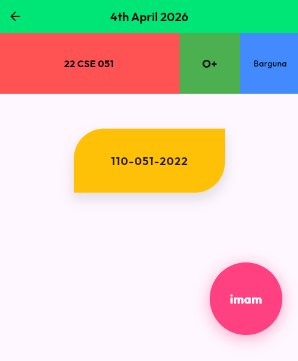

# Flutter UI Design Task

This project contains a specialized Flutter UI implementation based on a specific layout design.

## Task Overview
The goal of this task was to recreate a particular UI layout using Flutter basic widgets like `Container`, `Row`, `Column`, `Align`, and `Stack` with precise decorations and alignments.

## Key Features
- **Header**: A custom AppBar with a vibrant green background.
- **Top Metrics**: A `Row` with three expanded blocks for:
  - **Roll**: 22 CSE 051 (Red block)
  - **Blood Group**: O+ (Green block)
  - **District**: Barguna (Blue block)
- **Central Card**: A custom Yellow container with specific rounded corners (`topLeft` and `bottomRight`) representing registration details.
- **Floating Element**: A magenta circle aligned to the bottom right containing the nickname: **imam**.

## Design Hints Followed
- Custom `BoxDecoration` with specific `BorderRadius`.
- Alignment using `Spacer` and `Align`.
- Flexible layouts with `Expanded` widgets.

## Running the app
The main entry point is updated to show `DesignPage` as the default home screen.

## Image of the app
